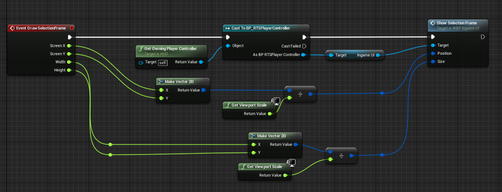
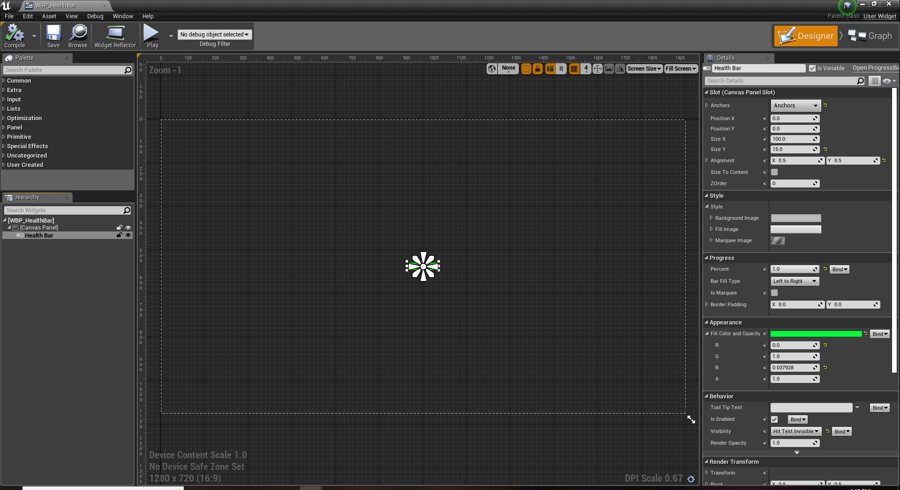
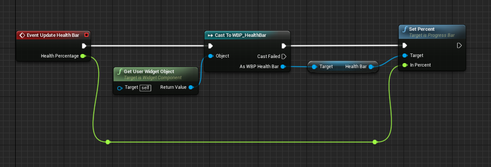

## Creating The User Interface

#### Selection Frames

In your HUD, implement the DrawSelectionFrame and HideSelectionFrame events as desired.

Example:

1. Create a widget for drawing the selection frame.

2. Add your widget to any kind of user interface your player controller knows about.
3. In that user interface, provide a function for showing the selection frame.

3. In the user interface, provide a function for hiding the selection frame.

4. In your HUD, forward the DrawSelectionFrame event to your UI.

5. In the HUD, forward the HideSelectionFrame event to your UI.

### Selected Unit Status

1. Create a new widget blueprint.
1. Create the widget where appropriate (e.g. BeginPlay of your player controller) and add it to your viewport.
1. Listen to the OnSelectionChanged event broadcasted by the RTSPlayerController and update your UI.

### Health Bars

1. In your HUD, set AlwaysShowHealthBars, ShowHoverHealthBars, ShowSelectionHealthBars and ShowHotkeyHealthBars as desired.
2. Create a widget for drawing the health bar.

_You might want to make sure that the visibility of the widget is set to Hit Test Invisible. Otherwise, it will block mouse input from your player._

3. Create a component deriving from RTSHealthBarWidgetComponent, and set its Widget Class to your health bar widget.
4. Forward the Update Health Bar event to your health bar widget.

5. Forward the Update Position And Size event to your health bar widget.

### Hovered Actors

2. Create a widget for drawing name plates (or whatever other information you'd like to display for hovered actors).

_You might want to make sure that the visibility of the widget is set to Hit Test Invisible. Otherwise, it will block mouse input from your player._

3. Create a component deriving from RTSHoveredActorWidgetComponent, and set its Widget Class to your new widget widget.
4. Forward the Update Data event to your widget.

5. Forward the Update Position And Size event to your widget.

### Building Cursors

1. Create an actor deriving from RTSBuildingCursor (or use the BP_RTSBuildingCursor shipped with the plugin).
1. In your player controller, set the building cursor reference.

### Construction UI

1. Use Get Constructible Building Classes of a selected builder to create buttons for your construction options (e.g. whenever the player controller raises OnSelectionChanged).
1. Call BeginBuildingPlacement of your player controller whenever one of these buttons is clicked.

### Construction Progress Bars

1. In your HUD, set AlwaysShowConstructionProgressBars, ShowHoverConstructionProgressBars, ShowSelectionConstructionProgressBars and ShowHotkeyConstructionProgressBars as desired.
2. Create a widget for drawing the construction progress bar.

_See the Health Bars section for an example.

3. Create a component deriving from RTSConstructionProgressBarWidgetComponent, and set its Widget Class to your progress bar widget.
4. Forward the Update Progress Bar event to your progress bar widget.
5. Forward the Update Position And Size event to your progress bar widget.

### Resources UI

1. Create a widget for showing your current resources.
1. Handle the OnResourcesChanged event raised by the PlayerResourcesComponent attached to your player controller to update your UI.

### Hovered Actors

2. Create a widget for drawing name plates (or whatever other information you'd like to display for hovered actors).

_You might want to make sure that the visibility of the widget is set to Hit Test Invisible. Otherwise, it will block mouse input from your player._

3. Create a component deriving from RTSHoveredActorWidgetComponent, and set its Widget Class to your new widget widget.
4. Forward the Update Data event to your widget.

5. Forward the Update Position And Size event to your widget.

